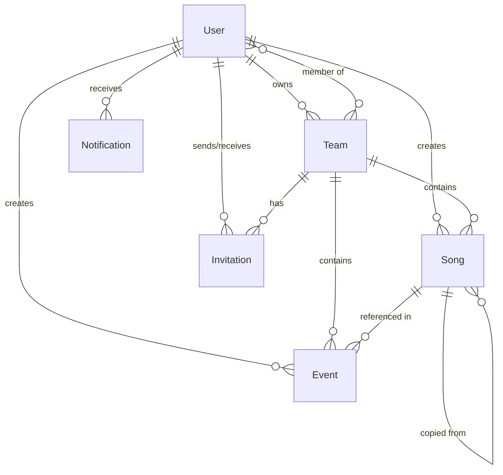
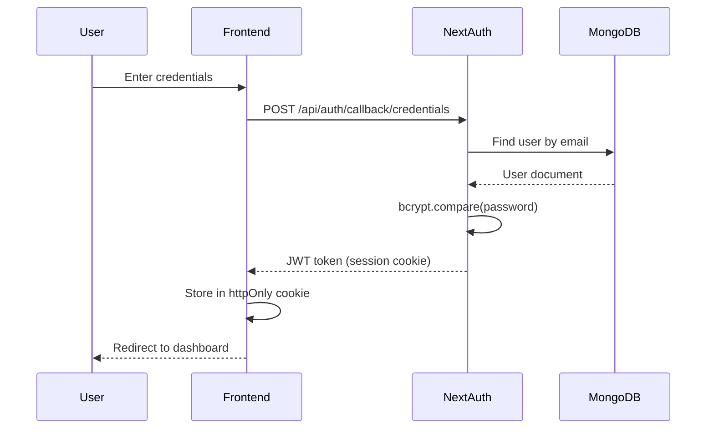
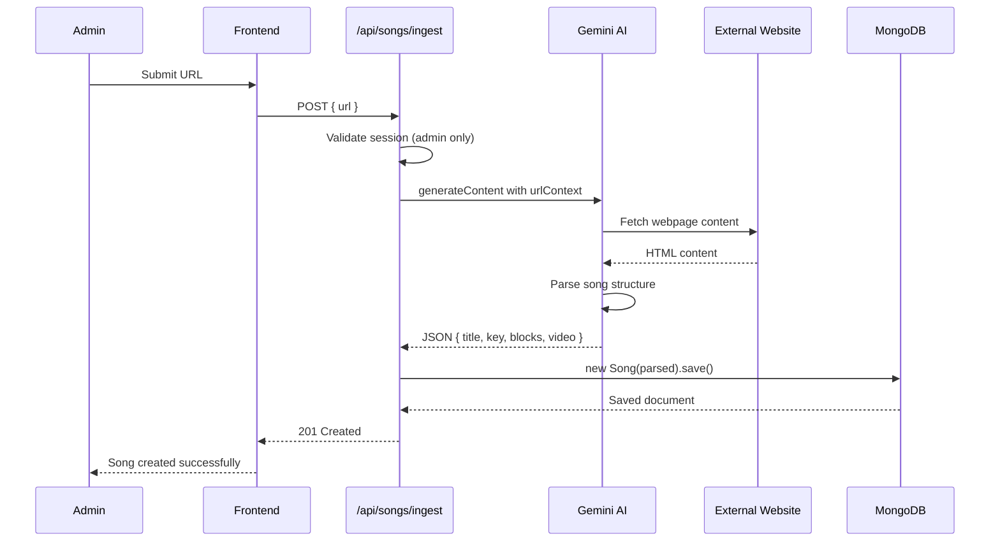
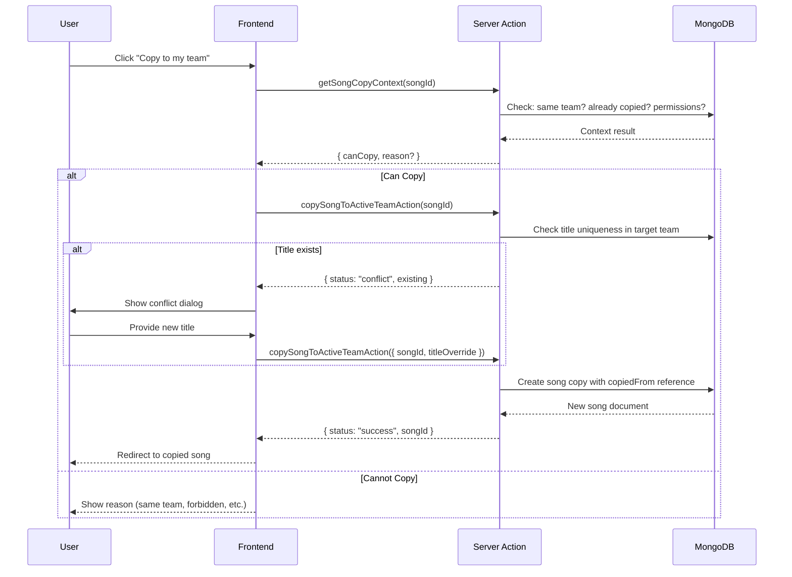
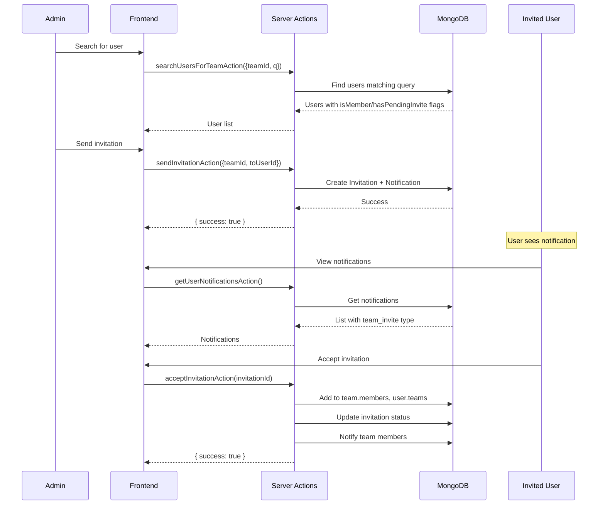

# NL Music 2 - Project Structure Documentation

> **Comprehensive Deep-Dive Audit** of the Church Worship Song Management Platform
>
> Last Updated: January 10, 2026

---

## Table of Contents

1. [Project Core & Tech Stack](#1-project-core--tech-stack)
2. [Database Architecture (MongoDB)](#2-database-architecture-mongodb)
3. [App Routing & Pages](#3-app-routing--pages)
4. [Business Logic & Functions](#4-business-logic--functions)
5. [Feature Map](#5-feature-map)
6. [Interactions & Data Flow](#6-interactions--data-flow)
7. [Styling & UI Patterns](#7-styling--ui-patterns)

---

## 1. Project Core & Tech Stack

### Framework & Router

| Property | Value |
|----------|-------|
| **Framework** | Next.js (App Router) |
| **Version** | `latest` |
| **Language** | TypeScript |
| **Target** | ES2015 |
| **Module Resolution** | Bundler |

### Major Dependencies

#### Authentication & Security
| Package | Version | Purpose |
|---------|---------|---------|
| `next-auth` | ^4.24.5 | Authentication (Credentials Provider, JWT sessions) |
| `bcryptjs` | ^2.4.3 | Password hashing |

#### AI & External Services
| Package | Version | Purpose |
|---------|---------|---------|
| `@google/genai` | ^1.27.0 | Gemini AI SDK for song ingestion from URLs |
| `cloudinary` | ^2.8.0 | Image upload and management |

#### Database
| Package | Version | Purpose |
|---------|---------|---------|
| `mongoose` | ^8.0.0 | MongoDB ODM |

#### UI Libraries
| Package | Version | Purpose |
|---------|---------|---------|
| `@radix-ui/*` | Various | Headless UI primitives (dialog, dropdown, accordion, etc.) |
| `@headlessui/react` | ^1.7.17 | Additional accessible UI components |
| `@heroicons/react` | ^2.0.18 | Icon library |
| `lucide-react` | ^0.292.0 | Additional icons |
| `react-icons` | ^4.12.0 | Icon collection |
| `@hello-pangea/dnd` | ^16.5.0 | Drag and drop functionality |

#### Styling & Utilities
| Package | Version | Purpose |
|---------|---------|---------|
| `tailwindcss` | latest | Utility-first CSS framework |
| `tailwind-merge` | ^2.0.0 | Merge Tailwind classes |
| `class-variance-authority` | ^0.7.0 | Variant-based component styling |
| `clsx` | ^2.0.0 | Conditional classnames |

#### Music Theory
| Package | Version | Purpose |
|---------|---------|---------|
| `tonal` | ^6.0.1 | Music theory library for chord transposition |

#### State Management & Data
| Package | Version | Purpose |
|---------|---------|---------|
| `zustand` | ^5.0.8 | Lightweight state management |
| `query-string` | ^9.1.1 | URL query string parsing |
| `date-fns` | ^2.30.0 | Date utilities |

#### Other
| Package | Version | Purpose |
|---------|---------|---------|
| `react-share` | ^5.1.0 | Social sharing buttons |
| `react-toastify` | ^10.0.4 | Toast notifications |
| `react-day-picker` | ^8.9.1 | Calendar/date picker |
| `sharp` | ^0.32.6 | Image optimization |
| `next-sitemap` | ^4.2.3 | SEO sitemap generation |

### Configuration Files

| File | Purpose |
|------|---------|
| `next.config.js` | Next.js configuration (experimental serverActions, Cloudinary image domains) |
| `tailwind.config.ts` | Tailwind CSS customization (colors, fonts, animations) |
| `middleware.ts` | Route protection using NextAuth |
| `tsconfig.json` | TypeScript configuration with `@/*` path alias |
| `postcss.config.js` | PostCSS with Tailwind and Autoprefixer |

---

## 2. Database Architecture (MongoDB)

**Database Name:** `nl_music_new`

### Entity Relationship Diagram



### Collection Schemas

#### User Collection

| Field | Type | Required | Description |
|-------|------|----------|-------------|
| `name` | String | ✓ | User's full name |
| `email` | String | ✓ | Unique email address |
| `password` | String | | Hashed password (bcrypt) |
| `image` | String | | Profile image URL (Cloudinary) |
| `nickname` | String | | Optional display name |
| `role` | String | ✓ | System role (e.g., "admin", "user") |
| `activeTeam` | ObjectId → Team | | Currently selected team |
| `teams` | ObjectId[] → Team | | All teams user belongs to |

#### Song Collection

| Field | Type | Required | Description |
|-------|------|----------|-------------|
| `title` | String | ✓ | Song title |
| `key` | String | ✓ | Musical key (e.g., "C", "Dm", "F#m") |
| `mode` | String | | Musical mode |
| `rythm` | String | | Rhythm pattern |
| `tags` | String | | Comma-separated tags |
| `comment` | String | | Notes about the song |
| `origin` | String | | Source URL |
| `video` | String | | Embedded YouTube URL |
| `ourVideo` | String | | Custom video URL |
| `blocks` | Array | ✓ | Song structure (verses, choruses, etc.) |
| `blocks.name` | String | | Block name (e.g., "Verse 1", "Chorus") |
| `blocks.version` | Number | ✓ | 1=words+chords, 2=words only, 3=chords only |
| `blocks.lines` | String | ✓ | Content with line breaks |
| `blocks.ind` | Number | ✓ | Block index |
| `team` | ObjectId → Team | | Owning team |
| `createdBy` | ObjectId → User | | Original creator |
| `copiedFrom` | ObjectId → Song | | Source song (if copy) |
| `copiedBy` | ObjectId → User | | User who copied |
| `copiedAt` | Date | | Copy timestamp |
| `isOriginal` | Boolean | | Default: true |

**Index:** `{ team: 1, title: 1 }` (unique) - Ensures unique song titles per team

#### Event Collection

| Field | Type | Required | Description |
|-------|------|----------|-------------|
| `title` | String | ✓ | Event name |
| `date` | Date | ✓ | Event date |
| `live` | String | | Live stream URL |
| `playList` | String | | Playlist URL |
| `songs` | Array | | Songs for this event |
| `songs.song` | ObjectId → Song | | Reference to song |
| `songs.ind` | String | ✓ | Order index |
| `songs.comment` | String | | Performance notes |
| `songs.title` | String | | Denormalized title |
| `team` | ObjectId → Team | | Owning team |
| `createdBy` | ObjectId → User | | Creator |

#### Team Collection

| Field | Type | Required | Description |
|-------|------|----------|-------------|
| `name` | String | ✓ | Team name |
| `description` | String | | Team description |
| `avatar` | String | | Team avatar URL |
| `coverImage` | String | | Cover image URL |
| `city` | String | | City location |
| `church` | String | | Church affiliation |
| `owner` | ObjectId → User | ✓ | Team owner |
| `members` | Array | | Team membership list |
| `members.user` | ObjectId → User | ✓ | Member reference |
| `members.role` | String | | "admin", "editor", or "member" |
| `members.instrument` | String | | Member's instrument |
| `members.joinedAt` | Date | | Join date |
| `members.invitedBy` | ObjectId → User | | Inviter reference |
| `settings.isPrivate` | Boolean | | Default: false |
| `settings.allowCopying` | Boolean | | Default: true |
| `createdAt` | Date | | Auto-generated |
| `updatedAt` | Date | | Auto-generated |

#### Invitation Collection

| Field | Type | Required | Description |
|-------|------|----------|-------------|
| `team` | ObjectId → Team | ✓ | Target team |
| `from` | ObjectId → User | ✓ | Sender |
| `to` | ObjectId → User | ✓ | Recipient |
| `status` | String | | "pending", "accepted", "declined", "cancelled" |
| `expiresAt` | Date | | Default: 7 days from creation |
| `createdAt` | Date | | Auto-generated |

**Indexes:**
- `{ to: 1, status: 1 }` - Fast lookup of active invitations
- `{ team: 1, to: 1 }` - Prevent duplicate invitations

#### Notification Collection

| Field | Type | Required | Description |
|-------|------|----------|-------------|
| `user` | ObjectId → User | ✓ | Recipient |
| `type` | String | ✓ | "team_invite", "role_change", "removed_from_team", "team_update" |
| `data` | Mixed | ✓ | Notification payload |
| `isRead` | Boolean | | Default: false |
| `createdAt` | Date | | Auto-generated |

**Index:** `{ user: 1, isRead: 1 }` - Fast unread count queries

---

## 3. App Routing & Pages

### Route Overview

```
app/
├── page.tsx                     # Home page (Hero + CTAs)
├── layout.tsx                   # Root layout (Navbar + Footer + Providers)
├── globals.css                  # Global styles
│
├── songs/
│   ├── page.tsx                 # Song library with search & filters
│   ├── layout.tsx               # Songs layout
│   ├── [slug]/page.tsx          # Single song view
│   ├── [slug]/edit/page.tsx     # Edit song
│   ├── add-by-link/page.tsx     # AI song ingestion
│   └── tags/                    # Tag-based filtering
│       ├── page.tsx
│       └── [tag]/page.tsx
│
├── events/
│   ├── page.tsx                 # Event (setlist) listing
│   ├── layout.tsx               # Events layout
│   ├── [eventId]/page.tsx       # Single event view
│   ├── create-new/page.tsx      # Create event (🔒 Protected)
│   └── update-event/page.tsx    # Update event (🔒 Protected)
│
├── teams/
│   ├── page.tsx                 # All teams listing
│   ├── create/page.tsx          # Create new team
│   └── [teamId]/
│       ├── page.tsx             # Team profile
│       ├── edit/page.tsx        # Edit team settings
│       └── members/page.tsx     # Team member management
│
├── profile/page.tsx             # User profile page
├── notifications/page.tsx       # Notifications center
├── users/page.tsx               # User search
├── contacts/page.tsx            # Contact page
│
├── login-page/page.tsx          # Login form
├── signup-page/page.tsx         # Registration form
├── denied/page.tsx              # Access denied page
│
├── create-song/page.tsx         # Manual song creation (🔒 Protected)
├── update-song/page.tsx         # Song editing (🔒 Protected)
│
└── api/
    ├── auth/[...nextauth]/route.ts  # NextAuth handler
    ├── register/route.ts            # User registration
    ├── cloudinary/route.ts          # Image signature
    ├── songs/
    │   ├── route.ts                 # GET songs list
    │   ├── new/route.ts             # POST create song
    │   ├── single/route.ts          # GET single song
    │   ├── change/route.ts          # PUT update song
    │   ├── delete/route.ts          # DELETE song
    │   └── ingest/route.ts          # AI song parsing from URL
    └── events/
        ├── route.ts                 # GET events list
        ├── single/route.ts          # GET single event
        ├── update/route.ts          # PUT update event
        └── delete/route.ts          # DELETE event
```

### Protected Routes (Middleware)

```typescript
// middleware.ts
export const config = {
  matcher: [
    "/create-song",
    "/update-song",
    "/events/create-new",
    "/events/update-event",
  ],
};
```

### Page Descriptions

| Route | Purpose | Key Components |
|-------|---------|----------------|
| `/` | Landing page with hero section | `Hero` |
| `/songs` | Searchable song library with filters | `SearchTitle`, `SongFilter`, `CardList`, `AlphCard` |
| `/songs/[slug]` | Single song view with chord transposition | `SingleSongClient`, `TonalChanger` |
| `/songs/add-by-link` | AI-powered song ingestion from URL | `AddSongByLinkLink`, Form |
| `/events` | Yearly event (setlist) calendar | `YearAccordion`, `EventsPageComponent` |
| `/events/[eventId]` | Single event with song list | Event detail view |
| `/events/create-new` | Create worship setlist | `EventFormBlock`, `SearchTitleForEvent` |
| `/teams` | Browse all worship teams | Team cards |
| `/teams/[teamId]` | Team profile page | `TeamProfile` |
| `/teams/[teamId]/members` | Manage team members | `TeamMembersPageClient` |
| `/profile` | User profile & settings | Profile form |
| `/notifications` | Notification center | `NotificationsPageClient` |
| `/login-page` | Credentials login | Login form |
| `/signup-page` | User registration | Signup form |

---

## 4. Business Logic & Functions

### Server Actions Overview (`lib/actions/`)

#### songActions.ts (688 lines)

| Function | Description |
|----------|-------------|
| `getSongs(filter, page, searchQuery, scope)` | Paginated song retrieval with filters (all/pop/rare) |
| `searchSongsAction({q, filter, scope, mode})` | Search by title or lyrics text |
| `getSongById(id)` | Fetch single song with team/copy info populated |
| `createSongAction(formData)` | Create new song with uniqueness check per team |
| `updateSongAction(formData)` | Update song (requires editor role) |
| `deleteSong(songId)` | Delete song (requires admin role) |
| `getSongCopyContext(songId)` | Determine if user can copy a song |
| `copySongToActiveTeamAction({songId, titleOverride?})` | Copy song to user's active team |

#### teamActions.ts (511 lines)

| Function | Description |
|----------|-------------|
| `getActiveTeamAction()` | Get current user's active team |
| `getUserTeamsAction()` | List all teams user belongs to |
| `setActiveTeamAction(teamId)` | Switch active team |
| `createTeam(formData)` | Create new team (user becomes owner) |
| `getTeamById(teamId)` | Fetch team details |
| `getTeamMembers(teamId)` | Get team member list |
| `getTeamMembersWithDetailsAction(teamId)` | Get members with user profile data |
| `updateTeam(teamId, updates)` | Update team settings (admin only) |
| `deleteTeam(teamId)` | Delete team and all associated data |
| `updateTeamMemberRoleAction({teamId, userId, role})` | Change member role |
| `removeTeamMemberAction({teamId, userId})` | Remove member from team |
| `getAllTeamsAction()` | List all teams (for browse page) |
| `updateTeamCoverImageAction({teamId, newCoverImage})` | Update cover image |

#### eventActions.ts (188 lines)

| Function | Description |
|----------|-------------|
| `createEvent(formData)` | Create worship setlist |
| `updateEvent(formData)` | Update setlist |
| `getEventById(id)` | Fetch single event |
| `getAllEvents()` | Get events for active team |
| `deleteEvent(eventId)` | Delete event |
| `normalizeSongsForTeam(songs, teamId)` | Validate songs belong to team |

#### userActions.ts (225 lines)

| Function | Description |
|----------|-------------|
| `searchUsersAction({q, limit})` | Search users by name/email |
| `searchUsersForTeamAction({teamId, q, limit})` | Search for team invitation |
| `updateProfileAction({name?, nickname?, image?, instrument?})` | Update user profile |
| `getUserInstrumentAction(teamId)` | Get user's instrument for team |

#### invitationActions.ts (374 lines)

| Function | Description |
|----------|-------------|
| `sendInvitationAction({teamId, toUserId})` | Send team invitation |
| `acceptInvitationAction(invitationId)` | Accept invitation (join team) |
| `declineInvitationAction(invitationId)` | Decline invitation |
| `cancelInvitationAction(invitationId)` | Cancel sent invitation |
| `getUserInvitationsAction({direction?})` | List user's invitations |

#### notificationActions.ts (207 lines)

| Function | Description |
|----------|-------------|
| `createNotificationAction({userId, type, data})` | Create notification |
| `notifyTeamMembers({teamId, excludeUserIds?, type, data})` | Bulk notify team |
| `getUserNotificationsAction({onlyUnread?})` | Get user's notifications |
| `markNotificationAsReadAction(id)` | Mark as read |
| `markAllNotificationsAsReadAction()` | Mark all as read |
| `deleteNotificationAction(id)` | Delete notification |
| `markInvitationNotificationHandledAction(id)` | Mark invite as handled |

### Utility Functions (`lib/`)

#### chords.ts - Music Theory

| Function | Description |
|----------|-------------|
| `replaceBadChords(array)` | Normalize enharmonic spellings (Cb → B) |
| `replaceBadTonals(array)` | Standardize tonal names |
| `insertDoubledTonals(array)` | Add enharmonic equivalents |
| `pureTranspose(chord, interval)` | Transpose chord by interval |
| `changeChordsByTonal(mode, array)` | Apply mode-specific chord spelling |

#### progression.ts

| Function | Description |
|----------|-------------|
| `createProgression(mode)` | Generate chromatic progression from tonal |

#### permissions.ts - RBAC System

| Function | Description |
|----------|-------------|
| `getSessionUser()` | Get authenticated user |
| `requireActiveTeam()` | Require user has active team |
| `getUserRoleInTeam(userId, teamId)` | Get user's role in team |
| `getActiveTeamAndRole()` | Combined check for auth + team + role |
| `canCreateSong()` | Check song creation permission |
| `canEditSong(songId)` | Check song edit permission |
| `canDeleteSong(songId)` | Check song delete permission |
| `canManageTeam(teamId)` | Check team admin permission |
| `canCreateEvent()` | Check event creation permission |
| `canEditEvent(eventId)` | Check event edit permission |
| `canDeleteEvent(eventId)` | Check event delete permission |

**Role Permissions Matrix:**

| Action | Admin | Editor | Member |
|--------|-------|--------|--------|
| Create Song | ✓ | ✓ | ✗ |
| Edit Song | ✓ | ✓ | ✗ |
| Delete Song | ✓ | ✗ | ✗ |
| Create Event | ✓ | ✓ | ✗ |
| Edit Event | ✓ | ✓ | ✗ |
| Delete Event | ✓ | ✗ | ✗ |
| Manage Team | ✓ | ✗ | ✗ |

### API Routes (`app/api/`)

#### AI Song Ingestion (`/api/songs/ingest`)

This is the **core AI feature** that extracts songs from external URLs using Google Gemini:

```typescript
// Flow:
// 1. Admin submits URL
// 2. Gemini fetches page via urlContext tool
// 3. AI extracts: title, key, blocks (verses/choruses), video
// 4. Song saved to MongoDB
```

**Model:** `gemini-2.5-flash` (configurable via `GEMINI_MODEL` env)

**Prompt Engineering:**
- Enforces strict JSON schema
- Detects actual musical key (corrects website errors)
- Separates chords and lyrics onto alternating lines
- Extracts embedded YouTube videos

---

## 5. Feature Map

### Core Features

| Feature | Description | Key Files |
|---------|-------------|-----------|
| **Authentication** | Credentials-based login with JWT sessions | `configs/auth.ts`, `middleware.ts` |
| **Song Library** | CRUD operations for worship songs with blocks | `songActions.ts`, `SingleSongClient.tsx` |
| **Chord Transposition** | Real-time key change with music theory | `chords.ts`, `TonalChanger.tsx` |
| **AI Song Ingestion** | Parse songs from URLs using Gemini AI | `/api/songs/ingest/route.ts` |
| **Event/Setlist Management** | Create worship setlists with drag-drop | `eventActions.ts`, `useEventStore.ts` |
| **Team System** | Multi-team collaboration with RBAC | `teamActions.ts`, `permissions.ts` |
| **Song Copying** | Copy songs between teams with conflict resolution | `copySongToActiveTeamAction` |
| **Notifications** | Real-time alerts for team events | `notificationActions.ts`, `NotificationBell.tsx` |
| **Team Invitations** | Invite users with accept/decline flow | `invitationActions.ts` |
| **User Search** | Find users to invite to teams | `searchUsersForTeamAction` |
| **Image Upload** | Cloudinary integration for avatars | `cloudinary.ts`, `/api/cloudinary` |

### Search & Filtering

| Filter | Description |
|--------|-------------|
| **Title Search** | Regex-based title matching |
| **Text Search** | Search within song lyrics (`blocks.lines`) |
| **Popularity Filter** | Songs used most frequently in events |
| **Rarity Filter** | Unused or rarely used songs |
| **Team Scope** | Filter by active team or all teams |
| **Tag Filtering** | Filter by song tags |
| **Alphabetical** | Browse by Ukrainian alphabet |

---

## 6. Interactions & Data Flow

### Authentication Flow



### AI Song Ingestion Flow



### Song Copy Flow



### Team Invitation Flow



---

## 7. Styling & UI Patterns

### Tailwind CSS Configuration

**Font Family:** Manrope (Google Fonts), Inter

**Color Palette:**

| Token | Value | Usage |
|-------|-------|-------|
| `primary` | `#2563eb` | Primary actions, links |
| `primary-dark` | `#1e40af` | Hover states |
| `primary-50..950` | Blue scale | UI variations |
| `secondary-orange` | `#f79761` | Accents |
| `black-100` | `#2B2C35` | Text |
| `grey` | `#747A88` | Secondary text |
| `light-white` | `rgba(59,60,152,0.03)` | Subtle backgrounds |

**Background Images:**

| Token | Image |
|-------|-------|
| `bg-pattern` | `/pattern.JPG` |
| `bg-hero-bg` | `/hero-bg.png` |
| `bg-layout-bg` | `/hero.JPG` |
| `bg-guitar-bg` | `/guitar.png` |
| `bg-events-bg` | `/events.JPG` |

**Custom Animations:**
- `accordion-down` / `accordion-up` - Radix accordion transitions

### Global CSS Utilities

```css
.padding-x     /* sm:px-16 px-6 */
.flex-center   /* flex justify-center items-center */
.flex-between  /* flex justify-between items-center */
.blue_gradient /* Gradient text blue→cyan */
.orange_gradient /* Gradient text amber→yellow */
.glassmorphism /* Frosted glass effect */
.alph_card     /* Alphabetical song card styling */
```

### UI Component Library (`components/ui/`)

Radix-based primitives with consistent styling:

| Component | File | Purpose |
|-----------|------|---------|
| Accordion | `accordion.tsx` | Collapsible sections |
| AlertDialog | `alert-dialog.tsx` | Confirmation modals |
| Button | `button.tsx` | Styled buttons with variants |
| Calendar | `calendar.tsx` | Date picker calendar |
| DatePicker | `datePickerDemo.tsx` | Date selection |
| Dialog | `dialog.tsx` | Modal dialogs |
| DropdownMenu | `dropdown-menu.tsx` | Dropdown menus |
| Label | `label.tsx` | Form labels |
| Popover | `popover.tsx` | Popover content |
| RadioGroup | `radio-group.tsx` | Radio button groups |
| Select | `select.tsx` | Select dropdowns |

### Key Reusable Components

| Component | Purpose |
|-----------|---------|
| `Navbar` | Main navigation with auth state |
| `NavDropdownMenu` | Mobile navigation menu |
| `ActiveTeamBadge` | Shows current team with switcher |
| `NotificationBell` | Notification icon with unread count |
| `SearchTitle` | Autocomplete song search |
| `SearchWord` | Full-text lyrics search |
| `CardList` / `AlphCard` | Song listing by alphabet |
| `TagCard` | Song listing by tag |
| `SongsFeed` | Main song library grid |
| `SongBlock` | Single song block (verse/chorus) |
| `TonalChanger` | Key transposition controls |
| `CopySongButton` | Song copy with conflict handling |
| `TeamProfile` | Team information display |
| `TeamMembersPageClient` | Member management UI |
| `YearAccordion` | Events grouped by year |
| `EventFormBlock` | Event song selection |
| `Form` | Song creation/edit form |
| `AgreeModal` | Confirmation dialogs |

### State Management

**Zustand Store:** `store/eventStore.ts`

```typescript
interface EventStore {
  event: OurEvent;
  songs: GettedSong[];
  setEvent: (event) => void;
  setSongs: (songs) => void;
  updateSong: (index, songId, title) => void;
  clearSong: (index) => void;
  addSongSlot: () => void;
  removeSongSlot: (index) => void;
  reset: () => void;
}
```

Used for event creation/editing with song slot management.

---

## Directory Structure Summary

```
nl_music2/
├── app/                    # Next.js App Router pages
│   ├── api/                # API routes
│   ├── songs/              # Song pages
│   ├── events/             # Event pages
│   ├── teams/              # Team pages
│   └── ...                 # Other pages
├── components/             # React components (66 files)
│   ├── ui/                 # Radix-based primitives
│   ├── Events/             # Event-specific components
│   ├── Profile/            # Profile components
│   ├── Teams/              # Team components
│   ├── forms/              # Form components
│   └── shared/             # Shared components
├── configs/                # Configuration
│   └── auth.ts             # NextAuth configuration
├── constants/              # Static data
│   ├── index.ts            # Default values, team data
│   ├── filters.ts          # Filter options
│   └── scheduleData.ts     # Schedule constants
├── lib/                    # Business logic
│   ├── actions/            # Server Actions (6 files)
│   ├── chords.ts           # Music theory
│   ├── permissions.ts      # RBAC system
│   └── ...                 # Utilities
├── models/                 # Mongoose schemas (6 files)
├── store/                  # Zustand state
│   └── eventStore.ts
├── types/                  # TypeScript definitions
│   └── index.ts
├── utils/                  # Utilities
│   └── database.ts         # MongoDB connection
├── public/                 # Static assets
├── archive/                # Deprecated code
└── scripts/                # Build scripts
```

---

## Environment Variables

| Variable | Purpose |
|----------|---------|
| `MONGODB_URI` | MongoDB connection string |
| `NEXTAUTH_SECRET` | JWT signing secret |
| `NEXTAUTH_URL` | Application URL |
| `NEXT_PUBLIC_CLOUDINARY_CLOUD_NAME` | Cloudinary cloud name |
| `NEXT_PUBLIC_CLOUDINARY_API_KEY` | Cloudinary API key |
| `CLOUDINARY_API_SECRET` | Cloudinary API secret |
| `GEMINI_API_KEY` | Google Gemini AI key |
| `GEMINI_MODEL` | Gemini model name (default: gemini-2.5-flash) |

---

*Generated by AI-powered code analysis*
